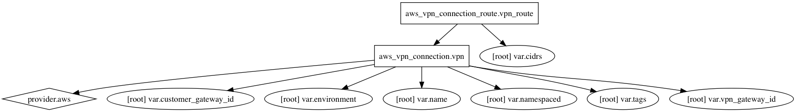

AWS VPN Terraform Module
=====================

Usage:
------

    module "vpn" {
      source      = "../tf_vpn"

      add variables
    }

## Inputs

| Name | Description | Default | Required |
|------|-------------|:-----:|:-----:|
| cidrs | CIDRS | - | yes |
| customer_gateway_id | Customer Gateway ID | - | yes |
| environment | Environment (ex: dev, qa, stage, prod) | - | yes |
| name | Name | - | yes |
| namespaced | Namespace all resources (prefixed with the environment)? | `true` | no |
| tags | A map of tags to add to all resources | `<map>` | no |
| vpn_gateway_id | VPN Gateway ID | - | yes |

### Resource Graph

